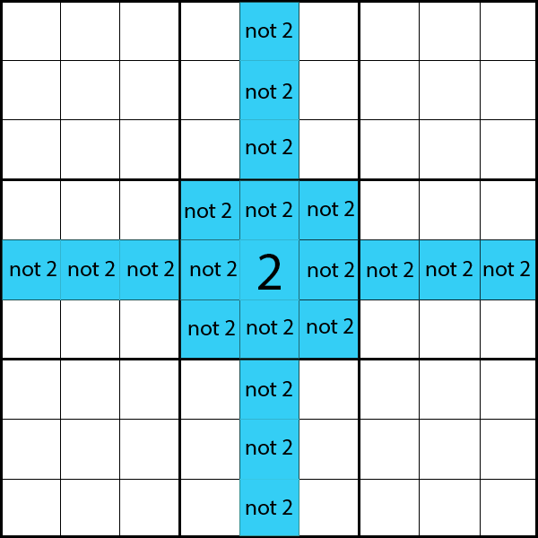

### Sudoku Solver
 
## Introduction
Sudoku is a puzzle in which the objective is to find the suitable numbers from 1 through to 9 for each cell adhering to the rules of the game. There are four golden rules in the game (Sudoku Online, 2020):
 
1. Each row must contain numbers from 1 to 9 without any repetitions.
2. Each column must contain numbers from 1 to 9 without any repetitions.
3. There can be no repetitions in a single block/nonet
4. The sum of every single row, column and nonet must equal to 45, the entire solved puzzle must sum to 405.
 
> **Note:** Sudoku solvers are usually implemented to solve only solvable puzzles but for the purpose of this assignment, we also take impossible sudokus into account.
 
## Implementing Solutions
One way to go about solving sudoku is to try all combinations, while this certainly would work given the size and the possibilities of sudoku leads to over 6×1021 possibilities. Given the current computing power this would take an astronomical amount of time. However, there are various algorithms which can solve sudokus in a far shorter time.
 
## A simple backtracking algorithm
Initially, I implemented a backtracking algorithm which would recursively guess the value for each cell. The implementation was simple,
 
1. Find an empty cell to populate with a number from 1 to 9.
2. Verify no rules have been violated.
3. If so, move on to the next cell.
4. If yes, backtrack to the last entered number and try other numbers.  
5. Iterate through the implementation until the entire grid results in a total sum of 405.
 
While this solution was successful and was able to solve every solvable puzzle in under a mere second. The algorithm struggled with unsolvable puzzles. As there are so many values to iterate over, to optimize this would be to  
 
## My solution
 
# Constraint Propagation
 
Constraint Propagation is a successful technique, where we describe the world in terms of decision variables that must be assigned values, we place explicit restriction on the values that are assigned henceforth. This leads to two assumptions about the problem (Kenneth, et al., 2006).
 
1. No uncertainty in the problem definition.
 
2. Problems are not dynamic.
 
Sudoku is a problem that respects both of these assumptions, given that the rules are definitive and the problem is dynamic. We can apply constraint propagation to sudoku to reduce our problem space as follows,
 
**Naive Approach** - Any empty cell in sudoku has the possibility of being a number from 1 through to 9.
 
**Sudoku as a constraint propagation problem** - Any empty cell in sudoku has the possibility of being a number from 1 through to 9 given that the same number is not on its row, column or its nonet.
 
The figure below demonstrates the dramatic reduction in problem space offered via constraint propagation.
 

# Improving Performance Further

The final implementation of my solver, the algorithm was further enhanced with 3 additioanls functions (``validRows`` , ``validColumns`` and ``validBoxes``) to check for invalid sudokus before trying to solve the puzzle. Then using contraint propogation to narrow the problem space (``constraintCheck``) and finally passing to an iterative function to perform depth first search and constraint propogation recusively (``search``). 
 
## Performance Metrics
 
Both implementations were sufficiently fast for the purpose of this assignment, both algorithms solving hard solvable sudokus under a second.
 
To measure the performance of algorithms I used different inputs. Below are some of the results that were gathered during testing.
 
| Problem   | Depth first search backtrack algorithm execution time (in s)  | Depth first search with backtracking and constraint propagation execution time (in s) |
| ----------- | ----------- | ------------------ |
| AI Escargot      | 2.178       |   1.038           |
| All Sudokus (provided with this task)   | < 600        |  8.610 |
 
The above results show a dramatic difference given the inputs. The problem lies with the unsolvable sudokus, the minimized problem space tackles this exception quite well. The bigger problem size took significantly longer to execute was to sum the sudoku grid as a final check to be equal to 405.
 
## Optimizing algorithmic performance through language-specific tools
 
- Using numpy
- Using list comprehension
- Using itertools
- Using builtin functions such as sum
 
## Future Works
 
### Strategies 

We can look further into reducing the problem space. In addition to constraint propagation, we can also utilize some other sudoku strategies. One such example is “Hidden Pairs”. A hidden pair occurs when a pair of numbers appears in exactly two squares in a row, column, or block, but those two numbers aren't the only ones in their squares.
 

 
Source: https://www.sudokuwiki.org/PuzImages/HP1.png
 
In the above example, the 7 and 6 highlighted in green are a hidden pair. The 7 and 6 only occur in those two squares and nowhere else in the row, so those two squares can only contain 7 and 6 and no other numbers. Hence, we can eliminate other candidates in those squares, as highlighted in yellow. 
 
This is an example of a basic strategy, however more complex and often better strategies can be found on https://www.sudokuwiki.org. 
 
### Better algorithms 
 
Through further research I discovered more efficient algorithms that appear to solve sudoku. An algorithm that appears to work particularly well is through presenting sudoku as an **exact cover problem** and solving it with **algorithm X**. Exact cover, as the name suggests, is about finding a solution (combination) so that each of the element is covered exactly once (G, 2011).

## Bibliography

G, A., 2011. Solving Sudoku Revisited. [Online] 
Available at: https://gieseanw.wordpress.com/2011/06/16/solving-sudoku-revisited/
[Accessed 28 March 2022].

Kenneth, N., Brown & Miguel, I., 2006. Foundations of Artificial Intelligence. 2nd ed. s.l.:Elsevier.

Sudoku Online, 2020. Sudoku Rules: Sudoku Online. [Online] 
Available at: https://www.sudokuonline.io/tips/sudoku-rules
[Accessed 28 March 2022].

